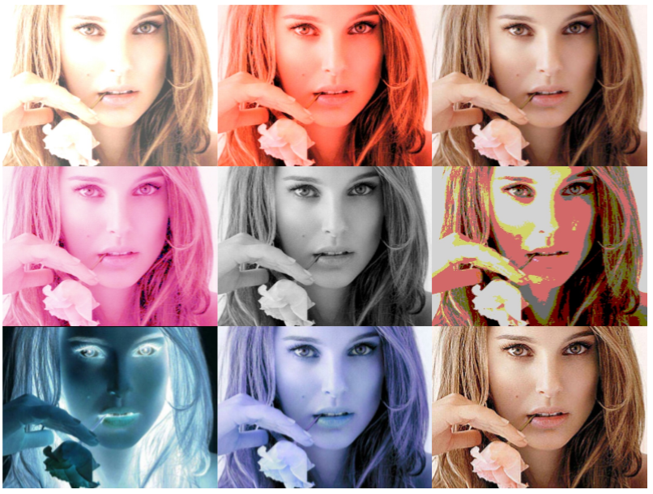

## ImageProcessingApp

##Overview
A simple image loading,processing method written in Android and Java. 
[Demo Video](https://www.dropbox.com/s/1i7zhw08yuh2517/%E9%99%84%E4%B8%AD%E9%AD%82-SpecialEffectCamera%20Demo.mp4?dl=0)
##Main Function
AlphaModification  
NegativeFilmEffect  
GrayScaleEffect  
GammaModification  
DecreaseColorDepth  
SepiaTonningEffect  
BrightnessControl  
RotateImage  
GaussianBlurEffect  
ImageSharpenEffect  
##Detail Report
[Report](https://goo.gl/rd8zm6)

